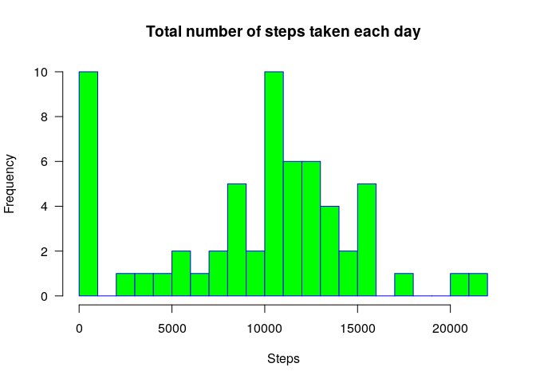
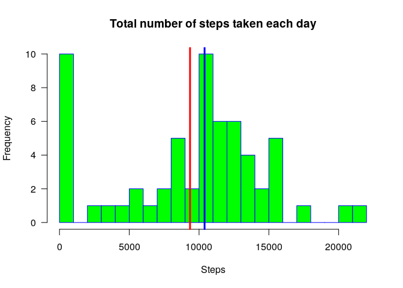
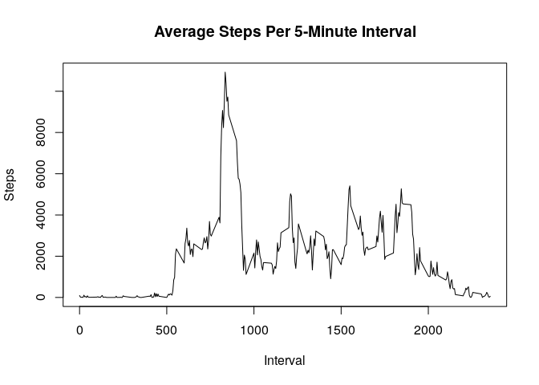
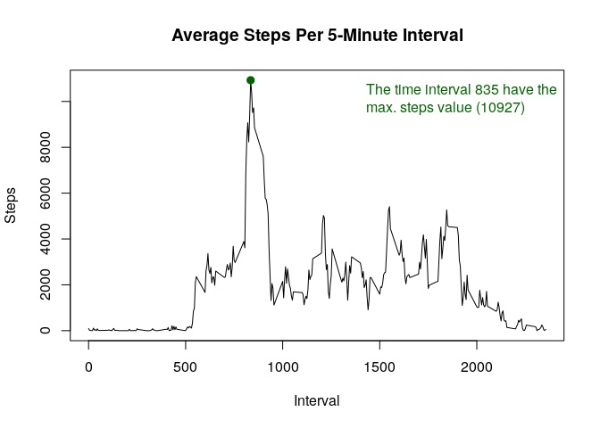
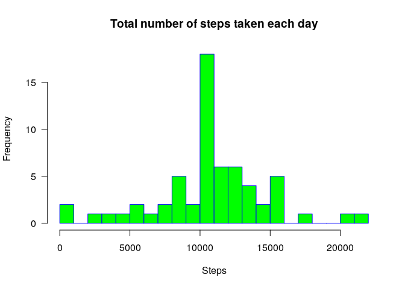
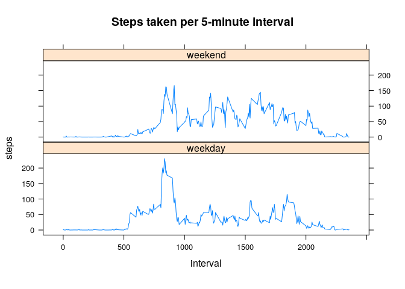

## Introduction

It is now possible to collect a large amount of data about personal movement using activity monitoring devices such as a Fitbit, Nike Fuelband, or Jawbone Up. These type of devices are part of the “quantified self” movement – a group of enthusiasts who take measurements about themselves regularly to improve their health, to find patterns in their behavior, or because they are tech geeks. But these data remain under-utilized both because the raw data are hard to obtain and there is a lack of statistical methods and software for processing and interpreting the data.

This assignment makes use of data from a personal activity monitoring device. This device collects data at 5 minute intervals through out the day. The data consists of two months of data from an anonymous individual collected during the months of October and November, 2012 and include the number of steps taken in 5 minute intervals each day.

## Data

The data for this assignment can be downloaded from the course web site:

* Dataset: [Activity monitoring data](https://d396qusza40orc.cloudfront.net/repdata%2Fdata%2Factivity.zip "activity.zip") [52K]
    

The variables included in this dataset are:

* steps: Number of steps taking in a 5-minute interval (missing values are coded as )
* date: The date on which the measurement was taken in YYYY-MM-DD format
* interval: Identifier for the 5-minute interval in which measurement was taken

The dataset is stored in a comma-separated-value (CSV) file and there are a total of 17,568 observations in this dataset.

## Loading and preprocessing the data

First of all, we need to check the libraries, clear all the variables, ..., restart the setup.


```r
# Author <- "José Mª Sebastián Carrillo"

rm(list = ls())

if (!require('plyr')) {
    stop('The package plyr was not installed!')
}
```

```
## Loading required package: plyr
```

```r
if (!require('lattice')) {
    stop('The package lattice was not installed!')
}
```

```
## Loading required package: lattice
```

```r
if (!require('timeDate')) {
    stop('The package timeDate was not installed!')
}
```

```
## Loading required package: timeDate
```

1. Code for reading in the dataset and/or processing the data.

Then, read the file and assing the correct metadata values

```r
activityDataFile <- "activity.csv"
activityData <- read.csv(activityDataFile, stringsAsFactors = FALSE, na.strings = "NA")
activityData$date <- as.Date(activityData$date)
```

Now we can see the data loaded

```r
str(activityData)
```

```
## 'data.frame':	17568 obs. of  3 variables:
##  $ steps   : int  NA NA NA NA NA NA NA NA NA NA ...
##  $ date    : Date, format: "2012-10-01" "2012-10-01" ...
##  $ interval: int  0 5 10 15 20 25 30 35 40 45 ...
```

## What is mean total number of steps taken per day?

2. Histogram of the total number of steps taken each day.

First, we need to aggregate the values per day and remane the data column

```r
activityPerDay <- aggregate(activityData$steps,
                            by=list(date=activityData$date),
                            FUN=sum,
                            na.rm=TRUE)
activityPerDay <- rename(activityPerDay,c("x"="steps"))
str(activityPerDay)
```

```
## 'data.frame':	61 obs. of  2 variables:
##  $ date : Date, format: "2012-10-01" "2012-10-02" ...
##  $ steps: int  0 126 11352 12116 13294 15420 11015 0 12811 9900 ...
```

And then plot the histogram

```r
hist(activityPerDay$steps,
     main="Total number of steps taken each day",
     xlab="Steps",
     border="blue",
     col="green",
     las=1,
     breaks=24)
```

<!-- -->

3. Mean and median number of steps taken each day

First, calculate the value of the mean...

```r
meanActivityPerDay <- mean(activityPerDay$steps)
meanActivityPerDay
```

```
## [1] 9354.23
```
...Then the median...

```r
medianActivityPerDay <- median(activityPerDay$steps)
medianActivityPerDay
```

```
## [1] 10395
```

...And shows at the histogram.

```r
hist(activityPerDay$steps,
     main="Total number of steps taken each day",
     xlab="Steps",
     border="blue",
     col="green",
     las=1,
     breaks=24)
abline(v=meanActivityPerDay, lwd = 3, col = 'red')
abline(v=medianActivityPerDay, lwd = 3, col = 'blue')
```

<!-- -->

## What is the average daily activity pattern?

4. Time series plot of the average number of steps taken.

First, we need to aggregate the values per interval and remane the data column

```r
activityPerInterval <- aggregate(activityData$steps,
                            by=list(interval=activityData$interval),
                            FUN=sum,
                            na.rm=TRUE)
activityPerInterval <- rename(activityPerInterval,c("x"="steps"))
str(activityPerInterval)
```

```
## 'data.frame':	288 obs. of  2 variables:
##  $ interval: int  0 5 10 15 20 25 30 35 40 45 ...
##  $ steps   : int  91 18 7 8 4 111 28 46 0 78 ...
```


```r
plot(x=activityPerInterval$interval,
     y=activityPerInterval$steps,
     type="l",
     main="Average Steps Per 5-Minute Interval",
     xlab="Interval",
     ylab="Steps")
```

<!-- -->

5. The 5-minute interval that, on average, contains the maximum number of steps.

Find the interval that have the maximum average steps

```r
maxInterval5Minute = activityPerInterval[which.max(activityPerInterval$steps), ]
maxInterval5Minute
```

```
##     interval steps
## 104      835 10927
```

Plot the data with the maximum value
First constructs the text label...

```r
maxTextLabel = paste('The time interval ', maxInterval5Minute$interval,
                     ' have the\nmax. steps value (', round(maxInterval5Minute$steps, 2), ')',
                     sep = '')
maxTextLabel
```

```
## [1] "The time interval 835 have the\nmax. steps value (10927)"
```
...And then shows it at the plot with the label.

```r
plot(x=activityPerInterval$interval,
     y=activityPerInterval$steps,
     type="l",
     main="Average Steps Per 5-Minute Interval",
     xlab="Interval",
     ylab="Steps")
points(x=maxInterval5Minute$interval,
       y=maxInterval5Minute$steps,
       col = 'dark green',
       lwd = 2,
       pch = 19)
legend("topright",
       legend = maxTextLabel,
       text.col = 'dark green',
       bty = 'n'
       )
```

<!-- -->

## Imputing missing values

6. Code to describe and show a strategy for imputing missing data.

Determine how much cases are missing

```r
sum(is.na(activityData$steps))
```

```
## [1] 2304
```

The strategy could be calculate the median value for this particular interval. For this proporse this function returns the values for this interval.

```r
intervalMedian <- function(x) {
    replace(x, is.na(x), mean(x, na.rm = TRUE))
}
```

So we can construct a new data frame with all the values filled.

```r
completeActivityData <- ddply(activityData, ~interval, transform, steps = intervalMedian(steps))
sum(is.na(completeActivityData$steps))
```

```
## [1] 0
```

```r
str(completeActivityData)
```

```
## 'data.frame':	17568 obs. of  3 variables:
##  $ steps   : num  1.72 0 0 47 0 ...
##  $ date    : Date, format: "2012-10-01" "2012-10-02" ...
##  $ interval: int  0 0 0 0 0 0 0 0 0 0 ...
```


7. Histogram of the total number of steps taken each day after missing values are imputed

First, we need to aggregate the values per day and remane the data column

```r
completeActivityPerDay <- aggregate(completeActivityData$steps,
                                    by=list(date=completeActivityData$date),
                                    FUN=sum,
                                    na.rm=TRUE)
completeActivityPerDay <- rename(completeActivityPerDay,c("x"="steps"))
str(completeActivityPerDay)
```

```
## 'data.frame':	61 obs. of  2 variables:
##  $ date : Date, format: "2012-10-01" "2012-10-02" ...
##  $ steps: num  10766 126 11352 12116 13294 ...
```

And then plot the histogram

```r
hist(completeActivityPerDay$steps,
     main="Total number of steps taken each day",
     xlab="Steps",
     border="blue",
     col="green",
     las=1,
     breaks=24)
```

<!-- -->

## Are there differences in activity patterns between weekdays and weekends?

8. Panel plot comparing the average number of steps taken per 5-minute interval across weekdays and weekends

Using the date value, obtains the number of the weekday, and assigns a value to "day".

```r
completeActivityData$day=ifelse(as.POSIXlt(as.Date(completeActivityData$date))$wday%%6==0,
                            "weekend",
                            "weekday")
# For Sunday and Saturday : weekend, Other days : weekday 
completeActivityData$day=factor(completeActivityData$day,
                                  levels=c("weekday","weekend"))
str(completeActivityData)
```

```
## 'data.frame':	17568 obs. of  4 variables:
##  $ steps   : num  1.72 0 0 47 0 ...
##  $ date    : Date, format: "2012-10-01" "2012-10-02" ...
##  $ interval: int  0 0 0 0 0 0 0 0 0 0 ...
##  $ day     : Factor w/ 2 levels "weekday","weekend": 1 1 1 1 1 2 2 1 1 1 ...
```


Using the new column data, make a plot with the two types of days (weekday-weekend).

```r
typeDayWeekData=aggregate(steps~interval+day,
                          completeActivityData,
                          mean)
xyplot(steps~interval|factor(day),
       data=typeDayWeekData,
       main ="Steps taken per 5-minute interval",
       aspect=1/4,
       layout = c(1, 2),
       type="l")
```

<!-- -->
